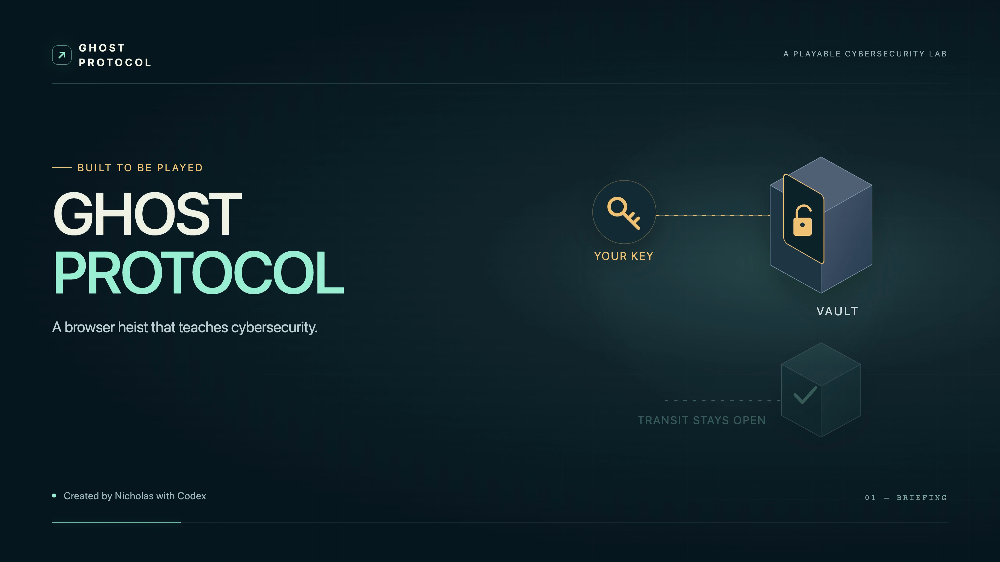

# Ghost Protocol

A tiny maintenance drone, a maze full of trouble, and a key that works for the wrong person too.

Ghost Protocol is a five-mission browser game inspired by classic maze chases. Collect access keys, recover the package, avoid the sentries, and lock the Vault behind you. Later missions add larger mazes, more pursuers, expiring access, and a separate Transit key for the exit.

The cybersecurity connection is part of the game. A copied credential can open the same gate. Revoking Vault access stops every holder from using it. Separate Transit access can keep working. The defender finale asks you to check both sides of a policy change: did the forbidden request fail, and can the legitimate worker still do the job?

I’m Nicholas. I built this with Codex, directing the gameplay, visual style, and learning experience through repeated reviews. Codex handled implementation and verification as we worked through each revision.

[How we built it](docs/HOW_IT_WAS_BUILT.md) · [What the security concepts mean](docs/CYBERSECURITY.md) · [Controls and technical detail](docs/TECHNICAL_GUIDE.md)

## Play

The approved local game is preserved locally as `approved-game-2026-09-05`. This repository contains the release source snapshot and creation story; the full iteration history remains preserved in the original local repository. The captioned 4K review film is delivered separately; [its verification and captions are included here](captures/release/VERIFICATION.md).

The [public deployment](https://ghost-protocol.jamalarthur1.chatgpt.site) opens without an account, but online steering has not passed the release check. It is a preview while the connection delay is being resolved. [Current hosting findings](docs/HOSTING.md).

Use a keyboard and a desktop browser. Arrow keys or WASD steer; the drone keeps moving until it meets a wall. Space brakes. Escape pauses. R or **Restart level** offers a fresh attempt. M changes the camera.

Keys collect when you cross them. Gates choose the matching key automatically. V means Vault; T means Transit. Clock readers renew the named key. After crossing the Vault exit, use the switch on the cyan side of the doorway to **Lock Vault behind you**. E and the visible action button do the same thing. Keep your Transit key active for extraction in the later missions.

New to the concepts? The introduction, optional practice exercises and paused field guide explain them. Learning notes stay brief during the chase. Nobody wants a policy lecture while a robot is chasing them.



## Run it locally

Use Node.js 24 and npm. These commands install the locked dependencies and start the game:

```sh
npm ci
npm run dev
```

Open [the local game](http://127.0.0.1:5320). The browser uses port 5320 and the development backend uses 5321. Both bind to loopback. An occupied port produces an error without stopping another process.

For a production build, run:

```sh
npm run build
npm start
```

The production server also defaults to port 5320. `GHOST_PROTOCOL_PORT` can select another free port from 5320 through 5329. On a Mac with a Codex-provided Node runtime outside the shell path, `./scripts/with-runtime.sh` runs the same npm commands.

## What is real, and what is a model?

The server owns actor positions, credentials, timers, permission decisions and outcomes. The browser requests actions; it cannot send a fabricated identity or declare a win. Every protected gate crossing goes through the authorization evaluator. The copied Vault key references the same grant, so revocation affects every holder.

The fictional package pickup represents a key-leak incident. Reading a file does not automatically copy credentials in real systems. Narrowing access in the defender finale proves the two displayed requests; a real incident also calls for replacing the exposed credential. This is a teaching game, not a complete identity platform or security assessment.

Campaign progress and preferences stay in browser storage. The game adds no player accounts, analytics tracking or online leaderboards. The hosting platform records its own traffic and operational logs. Local play uses Node. The current Sites preview uses a Worker and a database. A persistent Node server with a direct live connection is now prepared to remove the measured database delay. All modes reuse the same authoritative engine. [Repair and deployment plan](docs/REALTIME_REPAIR.md). A static host alone cannot enforce the game.

## Verify it

The test suite checks the campaign, authorization rules, session boundaries and hosted concurrency. The demo completes all five missions and the defender’s paired requests:

```sh
npm test
npm run build
npm run demo
```

The GitHub workflow runs these checks on Node.js 24. Real browser checks also cover mission completion, loss and retry, pause, reload, learning exercises, and Vault lockdown with Transit preserved. See the [technical guide](docs/TECHNICAL_GUIDE.md) for commands and evidence. Automated routes demonstrate behavior; they do not measure a newcomer’s playtime or learning.

## Art, music and rights

The geometry, characters, signs, interface and animations were made for this game. **The Quiet Way In** is an original electronic score composed in code, with synthesized music and effects. There are no downloaded art packs, stock songs or paid generation services.

Dependencies retain their own licenses. Source licensing is undecided; this repository does not grant a source license on its owner’s behalf.
