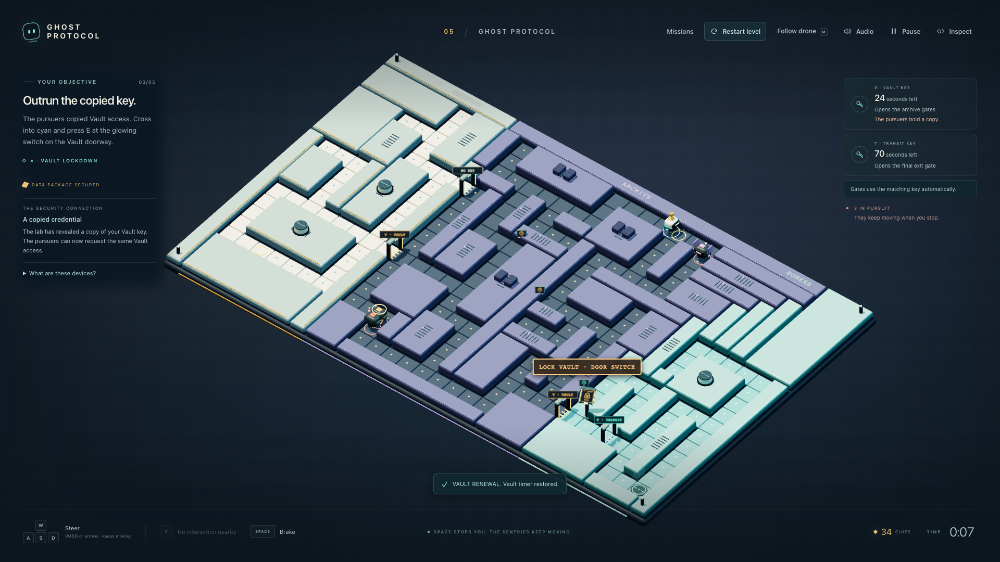
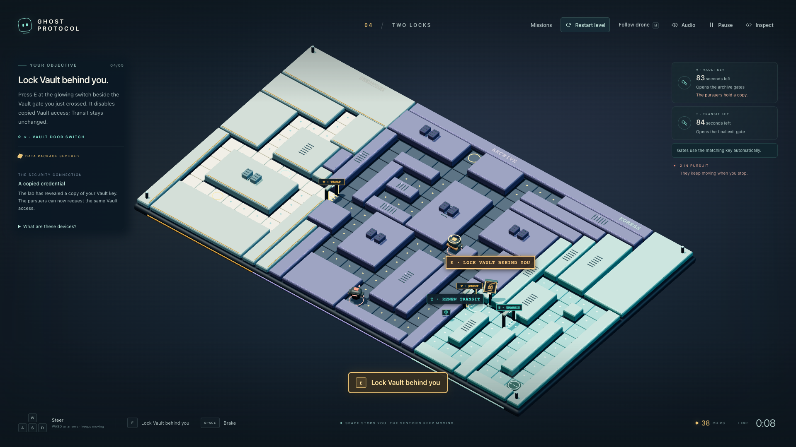
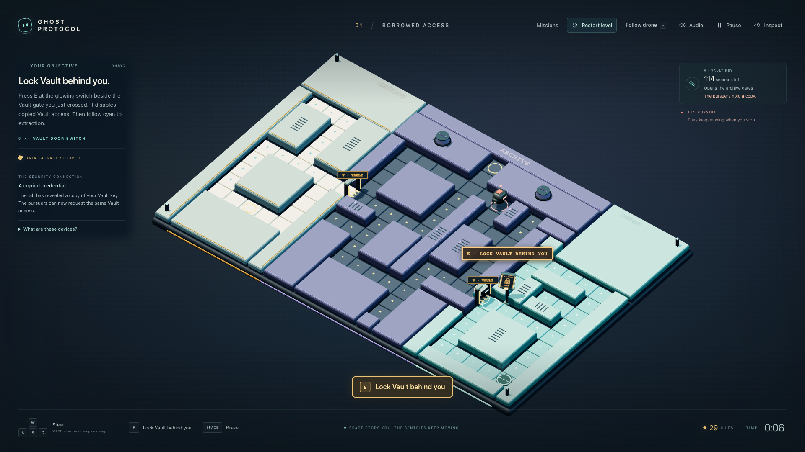

https://github.com/user-attachments/assets/31fb4bea-a96b-438a-9b4d-22c0eba4184e

# Ghost Protocol

I wanted to make a cybersecurity game that someone could enjoy before they knew the terminology.

Ghost Protocol is what came out of that: a small, Pac-Man-inspired maze chase about access keys, copied credentials, and knowing when to shut access down. You guide a maintenance drone through five facilities, recover a package, and get out while the sentries keep moving.

I'm Nicholas. I built this with Codex, directing the gameplay, visuals, and learning experience through repeated playthroughs and reviews. Codex handled implementation, automated checks, and gameplay captures. The project grew through that back-and-forth.

## Play it

**[Play Ghost Protocol in your browser](https://ghost-protocol-b74p.onrender.com)**

Use a desktop browser and keyboard. WASD or the arrow keys steer, Space brakes, E uses the nearby device, and Escape pauses. R or the visible **Restart level** button gives you a fresh attempt. M changes the camera.

The game runs on free hosting. In the recorded idle-start test, it took about twenty-five seconds to become ready. The immediate warm reload took about two and a half seconds. These are measured examples; future waits can differ. [Hosting results and limits](docs/HOSTING.md).



*Mission Five combines the larger maze, two access scopes, and three pursuers. This is a capture from the running browser game.*

## Why the keys matter

The basic loop is straightforward: collect access, reach the package, cross the Vault gate, and lock it behind you.

Collecting the package triggers a simulated credential leak. The pursuers can then use a copy of the same Vault access. The gate checks the permission they present, so an open route can help them too.

Lockdown revokes that shared Vault permission for every holder, including you. Later missions introduce a separate Transit key for the exit. You can contain the compromised access while keeping the permission you still need.



*Vault opens the archive. Transit opens the exit. The switch revokes Vault access and leaves Transit unchanged.*

Larger mazes, dead ends, expiring access, and renewal devices build on those rules. An optional introduction and practice exercises explain the concepts before the chase. Short notes and mission debriefs connect what happened to ordinary access-control tasks.

## How it took shape

The early version established the heist and access rules. After playing it, I wanted more colour, music, and a stronger maze-chase feel. I asked for independently moving enemies, continuous steering, and paths where a wrong turn could matter.

Once that felt right, the interface needed attention. Floor devices were unclear. Arriving at a gate with multiple keys opened a selection dialog and interrupted the chase. Some E prompts appeared where nothing useful happened. The Vault switch and sign overlapped.

We worked through those individually. Gates now select the matching key automatically. Devices explain their purpose. Prompts name the action the server will accept. The lockdown switch sits consistently on the cyan side of the Vault exit in every mission.

Apparently “just lock the door” needs a surprisingly clear button.



*The reviewed doorway layout keeps the Vault sign visible and puts the switch beside the exit.*

The first public host also exposed a problem the local game did not have: steering lag. We moved the online connection to a persistent Node server using WebSockets and checked the campaign again. Public testing then caught a reload conflict between the old and new connection. That was reproduced and fixed while preserving one controller per attempt.

[Read the build story](docs/HOW_IT_WAS_BUILT.md)

## The cybersecurity connection

My experience with software-as-a-service implementation, documentation, onboarding, and troubleshooting helps me connect access problems to the user workflows a security change needs to preserve.

This project gave me a practical way to work through several related skills:

- **Access control:** distinguish a credential from the resources its permissions allow.
- **Credential lifecycle:** explain scheduled expiry, renewal, and deliberate revocation.
- **Least privilege and containment:** remove access to one resource while preserving legitimate work elsewhere.
- **Validation:** check the request that should fail and the request that should still succeed.
- **Technical communication:** turn confusing behavior into clear requirements, onboarding, useful feedback, and a reproducible check.

The defender finale brings those ideas together. You compare broad access, disabling a shared credential, and narrowing its permissions. Completion requires an intruder's Vault request to fail while legitimate maintenance still works.

That paired check is the lesson I wanted people to take away: a security change needs an expected outcome for legitimate users too.

[Explore the security concepts](docs/CYBERSECURITY.md)

## Underneath the game

React and TypeScript handle the interface. Three.js renders the facility. The geometry, characters, interface, and synthesized soundtrack were made for this project.

The server owns positions, timers, permissions, and outcomes. The browser sends actions; it cannot choose an actor's identity or declare a win. Protected gate crossings go through the authorization evaluator.

The Neon Run revision passed 103 tests and the full local campaign, plus a public music and controls check. Earlier public verification covered all five missions, capture and retry, Vault lockdown, Transit preservation, the defender finale, and reload recovery. That earlier release passed 96 tests.

[Browser evidence](captures/render-free-review/VERIFICATION.md) · [Controls and technical guide](docs/TECHNICAL_GUIDE.md)

## Run it locally

With Node.js 24 installed, install the dependencies and start the game:

```sh
npm ci
npm run dev
```

Open [the local game](http://127.0.0.1:5320). To check the project:

```sh
npm test
npm run build
npm run demo
```

## Scope and limits

This is a teaching model. Reading a file does not normally copy a credential, and narrowing permissions does not erase a stolen copy. A real response may also require revoking and replacing exposed credentials.

Automated checks establish game behavior; they do not prove learning outcomes or production security experience. Completed progress stays in the same browser and play address. An active attempt resets if the host restarts.

Source licensing remains undecided. Dependencies retain their own licenses.
